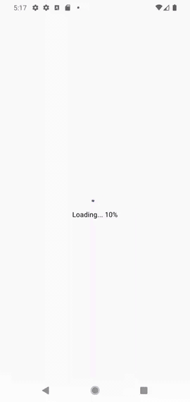

# Mini Map

Exhibitor list with an interactive mini floor plan that expands full-screen with route directions.

## Demo

## Features

- Preloaded floor plan with exhibitor list
- Booth highlighting on the plan via `selectBooth()`
- Expandable mini map with smooth animation (no WebView re-parenting)
- Route directions from entrance to selected booth via `selectRoute()`

## Tech Stack

Kotlin, Jetpack Compose, Material 3, Hilt, Navigation Compose

## Architecture

Single-activity MVVM app. The SDK's WebView-based plan is embedded in Compose via `AndroidView`.

| File | Purpose |
|------|---------|
| `PlanManager.kt` | Singleton managing the SDK presenter lifecycle |
| `PlanMapView.kt` | Reusable `AndroidView` wrapper for the SDK's native View |
| `ExhibitorListScreen.kt` | Exhibitor list loaded from the SDK |
| `ExhibitorDetailScreen.kt` | Detail screen with expand/collapse mini map |
